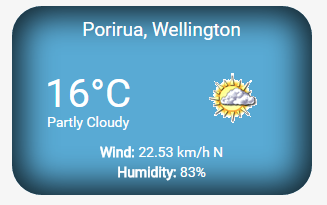

<h2>Show Weather Widget</h2>

Plugin Name: Show Weather 
Plugin URI: https://github.com/coder-karen/show_weather_widget 
Description: A Wordpress widget for displaying the current weather 
Version: 1.0 
Author: Karen Attfield 
Author URI: karenatt.carbonmade.com 
License: GPL V2 (or later)

To view a live demo visit: http://k1demo.byethost6.com/

<h2>Screenshot</h2>

<h2>Installation</h2>
To use the Show Weather Widget, download and unzip the plugin in your plugins directory in a folder named 'show-weather', then activate the plugin.

<h2>Usage</h2>
Once the widget is added to your plugin folder, you need to activate it from your Wordpress dashboard (click on Plugins, find Show Weather and click on activate).
Under Appearance, Widgets within your Wordpress Dashboard, move the widget into the area you would like it displayed and fill in location (the location where you would like weather information from) and the title of the widget.

<h2>Frequently Asked Questions</h2>

<strong>The location I typed in wasn't found - how can I find it?</strong>

Visit <a href="https://www.yahoo.com/news/weather">https://www.yahoo.com/news/weather</a>, search for your location and then copy name-ID format as shown at end of url. You can then paste this into the widgets 'location' field.

